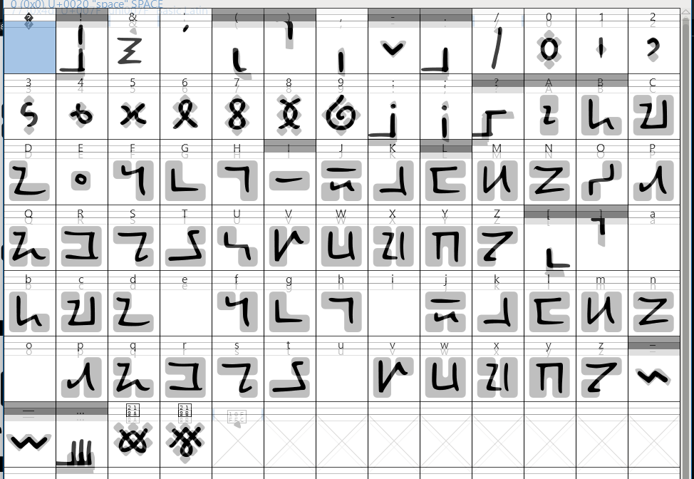

# 🚂 BlockTrain

<figure><picture><source srcset="../../.gitbook/assets/image_2025-03-24_163852377.png" media="(prefers-color-scheme: dark)"></picture><figcaption></figcaption></figure>

<table><thead><tr><th width="162">Name</th><th width="440">BlockTrain</th></tr></thead><tbody><tr><td>Version</td><td>1.47</td></tr><tr><td>Availability</td><td><em>Private commission for game design. May be released in the future, dependent on game developer's wishes.</em></td></tr><tr><td>Latest release</td><td>22nd March 2025</td></tr><tr><td>Inception</td><td>19th March 2025</td></tr><tr><td>Supported scripts</td><td>Latin, NewEng (partial), no diacritics. Basic punctuation &#x26; symbols.</td></tr><tr><td>Other glyphs</td><td><a data-footnote-ref href="#user-content-fn-1">Dozenal</a> glyphs (↊, ↋)</td></tr><tr><td>Issues</td><td>...</td></tr><tr><td>GitHub</td><td>-</td></tr><tr><td>Behance</td><td>-</td></tr><tr><td>Font sites</td><td>-</td></tr></tbody></table>

[^1]: Duodecimal — Base 12
