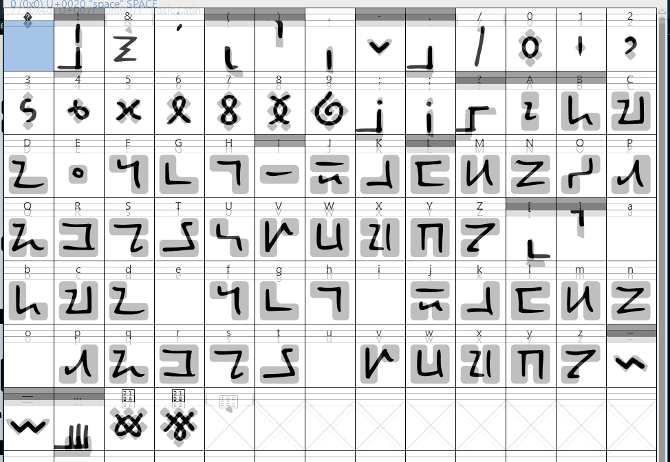

# 🚂 BlockTrain 🔒

Click the tabs to switch view between Block style and Hand style.



<figure><picture><source srcset="../../../.gitbook/assets/Story in BlockTrain Block _Dark.png" media="(prefers-color-scheme: dark)"></picture><figcaption></figcaption></figure>



<figure><picture><source srcset="../../../.gitbook/assets/Story in BlockTrain Hand _Dark.png" media="(prefers-color-scheme: dark)"></picture><figcaption></figcaption></figure>



## Info

<table><thead><tr><th width="162">Name</th><th width="440">BlockTrain</th></tr></thead><tbody><tr><td>Version</td><td>1.47</td></tr><tr><td>Availability</td><td><em>Private commission for game design. May be released in the future, dependent on game developer's wishes.</em></td></tr><tr><td>Latest release</td><td>22nd March 2025</td></tr><tr><td>Inception</td><td>19th March 2025</td></tr><tr><td>Supported scripts</td><td>Latin, NewEng (partial), no diacritics. Basic punctuation &#x26; symbols. </td></tr><tr><td>Other glyphs</td><td><a data-footnote-ref href="#user-content-fn-1">Dozenal</a> glyphs (↊, ↋)</td></tr><tr><td>Issues</td><td>Lowercase vowels exist as diacritic marks only, and are placed over the previous character. When starting a word with a vowel, us the uppercase letter instead. This case could be handled with contextual alternates, but when I made this typeface, I wasn't familiar with implementing OpenType features.</td></tr><tr><td>GitHub</td><td><em>Not available for unlicensed usage.</em></td></tr><tr><td>Behance</td><td>-</td></tr><tr><td>Font sites</td><td><em>Not available for unlicensed usage.</em></td></tr></tbody></table>

## Alphabet

The two writing styles of the Block script overlaid for visual comparison:

<figure><picture><source srcset="../../../.gitbook/assets/image_2025-03-24_163852377.png" media="(prefers-color-scheme: dark)"></picture><figcaption></figcaption></figure>

Details of how the alphabet was created are not included, partly because it's my own Secret Sauce, and partly because players of this game

## Numeral system

In black, the primary block-based numeral system.&#x20;

In red, the handwritten, pen-drawn numerals based upon the block form.

Numbers go up to 11. This is the dozenal[^2] system, base 12: 0 1 2 3 4 5 6 7 8 9 ↊ ↋.

<figure><figcaption></figcaption></figure>

Click the tabs to switch view between Block style and Hand style.



<figure><picture><source srcset="../../../.gitbook/assets/Numbers Dozenal in BlockTrain Block _Dark.png" media="(prefers-color-scheme: dark)"></picture><figcaption></figcaption></figure>



<figure><picture><source srcset="../../../.gitbook/assets/Numbers Dozenal in BlockTrain Hand _Dark.png" media="(prefers-color-scheme: dark)"></picture><figcaption></figcaption></figure>



## Review from the client on Fiverr

<figure><figcaption></figcaption></figure>

***

Read more reviews of my work in graphic design and other fields:


[https://app.gitbook.com/s/4g2MHu9J8li31PmfpbWI/work-reviews](https://app.gitbook.com/s/4g2MHu9J8li31PmfpbWI/work-reviews)


[^1]: Duodecimal — Base 12

[^2]: Also known as "duodecimal" but this name assumes that the foundation is "decimal", when actually it's not, "decimal" is just the currently chosen system. Thus we prefer to name the system independently of decimal, thus refer to it as "**dozenal**".
