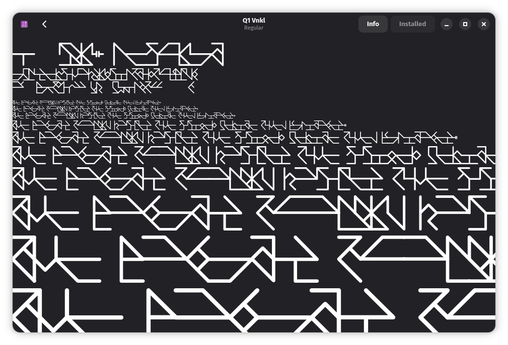

# Vihnkkeol Vertical Runes

This is the first font of its kind, designed for con-script "Vihnkkeol" for conlang "lhaedy tṡukh thul", created by Dr. Nyeh.

Links will be added soon to show you more of Nyeh's works.

* Conscript _Vihnkkeol_ is written vertically, top-to-bottom, left-to-right. _You can enable this setting in most word processors and graphics apps._

Please rotate your head, or your screen, 90° to correctly view this script!

<figure><figcaption>
Image of font at v0.300
</figcaption></figure>

## Info

<table><thead><tr><th width="162" valign="top">Name</th><th width="440">Vihnkkeol Vertical Runes</th></tr></thead><tbody><tr><td valign="top">Version</td><td>0.300</td></tr><tr><td valign="top">Availability</td><td>-</td></tr><tr><td valign="top">Latest release</td><td>2 February 2026</td></tr><tr><td valign="top">Inception</td><td>30 January 2026</td></tr><tr><td valign="top">Supported scripts</td><td>Vihnkkeolean (con-lang)</td></tr><tr><td valign="top">Other glyphs</td><td>-</td></tr><tr><td valign="top">Issues</td><td></td></tr><tr><td valign="top">GitHub</td><td>
Link to the github page to download.

<a href="https://github.com/fazzaan/font-vihnkkeol-conscript">github.com/fazzaan/font-vihnkkeol-conscript</a> 
</td></tr><tr><td valign="top">Behance</td><td>-</td></tr><tr><td valign="top">Font sites</td><td>-</td></tr></tbody></table>

## Letters

* Vihnkkeol script&#x20;
* _Vector image of all glyphs_

## Numerals

* Vihnkkeol numerals
* Special layout for numerical columns - T, H, U

## Sample words

* _Vector images of a range of words_

***

To Do

### Further development

* [x] ~~Numerals and custom placement~~
* [ ] Non-QWERTY unicode
* [ ] Non-QWERTY keyboard layout?

### Fixes

* [ ] Do hinting manually? — because the stems (horizontal) don't align when rendered despite being pixel-perfect aligned in the vectors

### Variants

* Other styles&#x20;

***

## Reviews

Read reviews of my work in graphic design and other fields:


[https://app.gitbook.com/s/4g2MHu9J8li31PmfpbWI/work-reviews](https://app.gitbook.com/s/4g2MHu9J8li31PmfpbWI/work-reviews)


